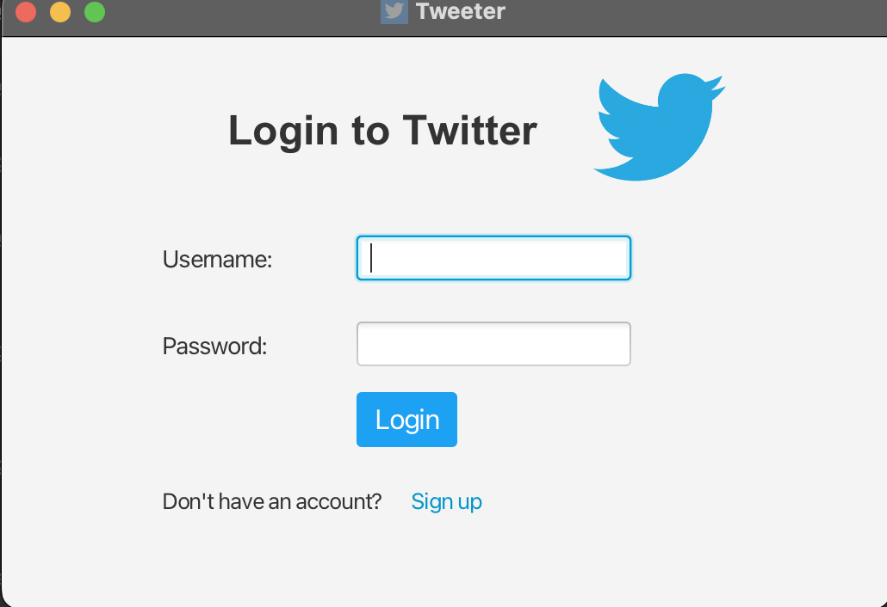
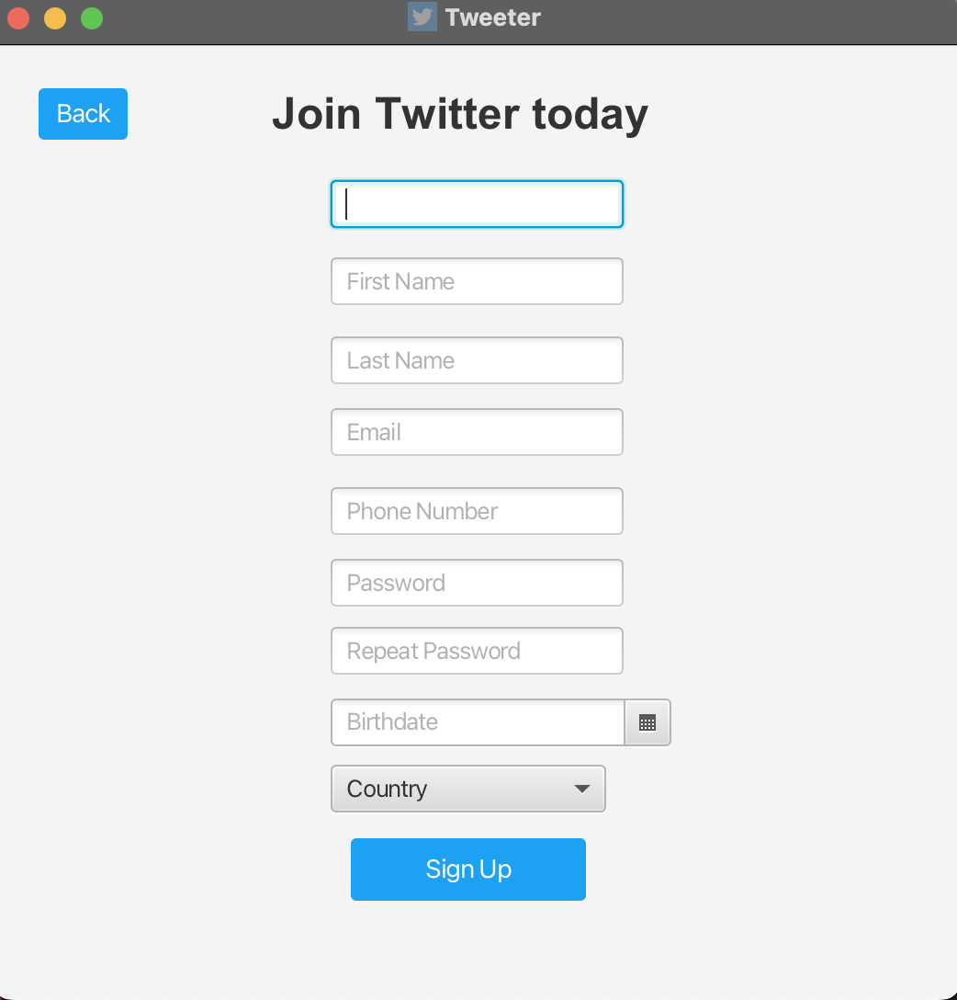
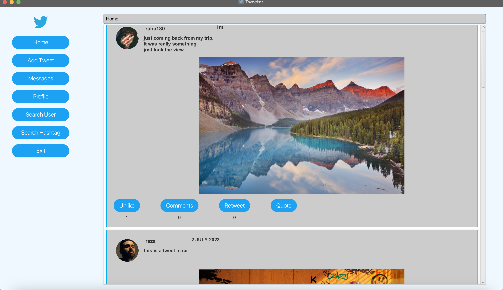
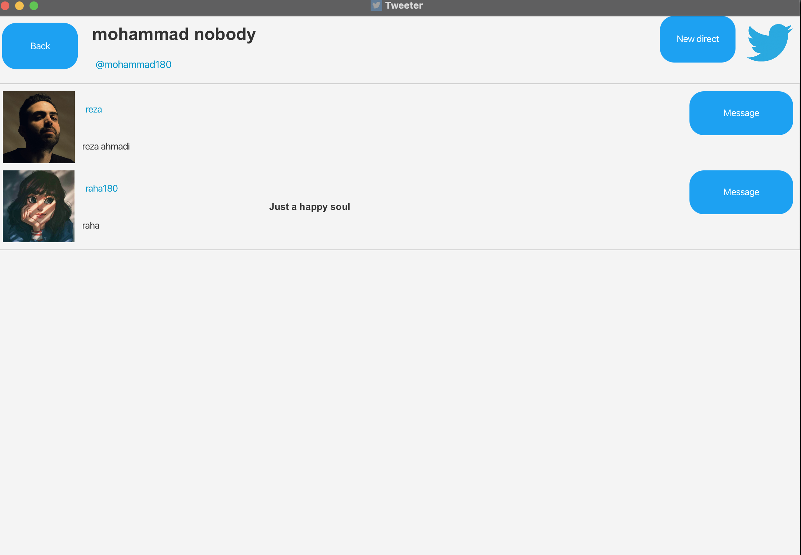
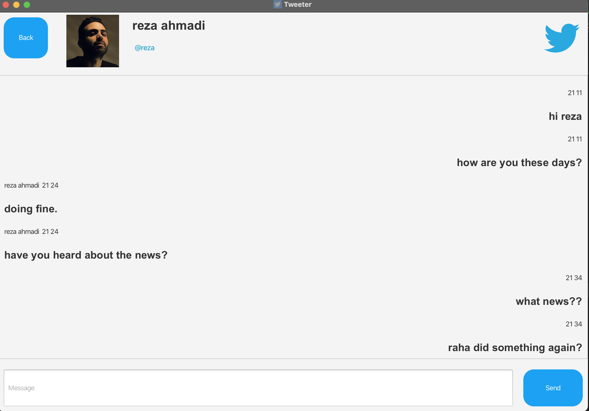
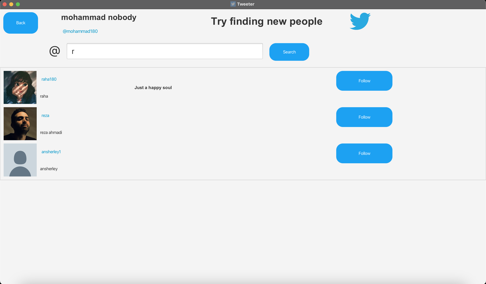
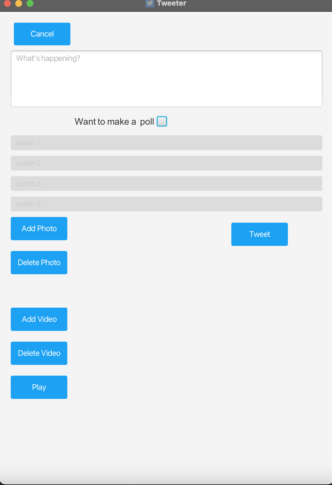
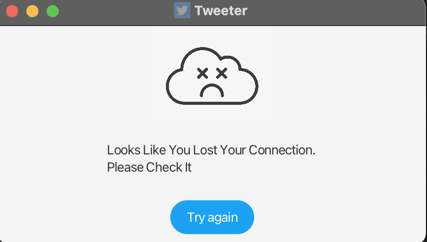

# AP-Project

## Description
This is the final project for advanced programming courses at AUT.
The purpose was to build a desktop application like Tweeter written in Java and JavaFX.

## Screenshots

